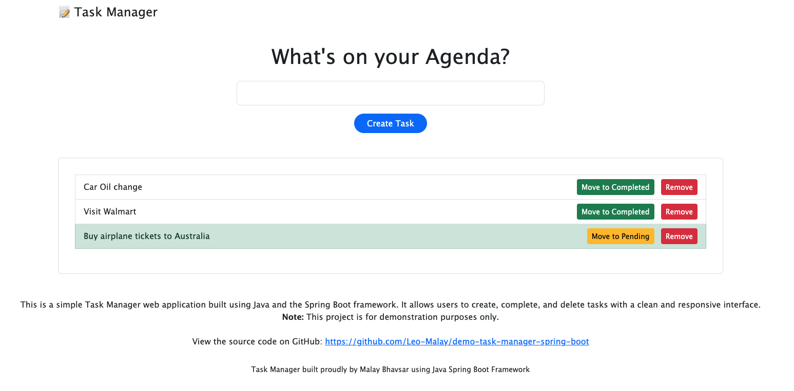

# Task Manager

A simple Task Manager web application built with **Java Spring Boot**.

## Features

- Create, update, complete, and delete tasks.
- Simple REST API backend with a clean frontend.
- Demonstration project for learning Spring Boot and REST APIs.

## Screenshot



## Tech Stack

- Java 24
- Spring Boot
- Spring Data JPA (Hibernate)
- H2 or any relational database (configurable)
- HTML + Bootstrap frontend

## Getting Started

### Prerequisites

- Java 24 or higher
- Maven (for building)
- A relational database (H2 embedded by default)

### Build and Run Locally

```bash
java --version
mvn --version

mvn clean package
mvn spring-boot:run
```

App will start on `http://localhost:8080/index.html`

### Build Docker Container

This app is enabled with docker container ability. Please use the following commands to dockerized the app.

```bash
docker build -t day2day-app:<VERSION> .
```

Now to run the docker app use the following command.

```bash
docker run -p 8080:8080 day2day-app:<VERSION>
```

## Notes

This project is for demonstration and learning purposes only.

Feel free to extend and improve it.
